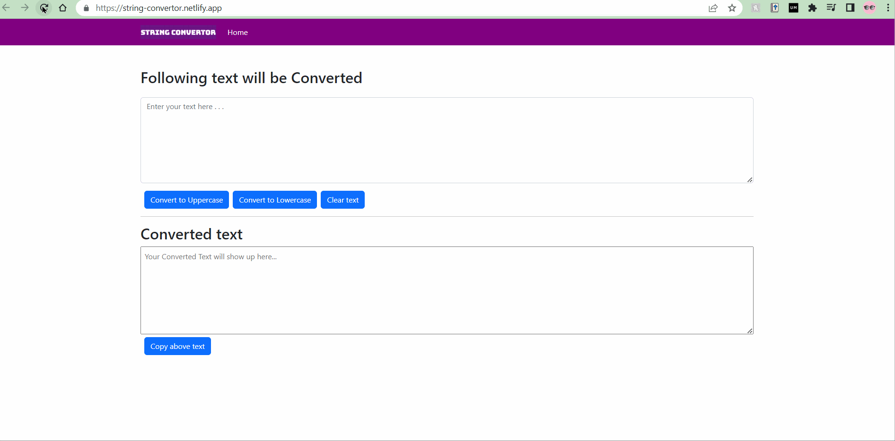

# String value convertor

## Purpose

The main purpose of this project is to perform some basic functionality on a string inserted by a user. React app and bootstrap lib has been used to build this website. The actual website has been deployed at [https://string-convertor.netlify.app/]

This website has been created to get familiar with the concepts of react app framework and bootstrap lib.

### Functionalities
* Convert any string to the uppercase.
* Convert any string to the lowercase.
* Copy whole converted string.

